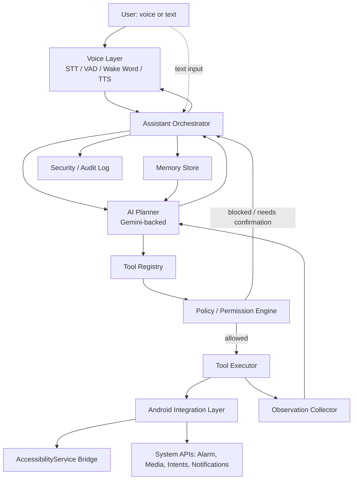

# 05 — System Architecture

## Layered Overview



## Component Responsibilities

- **Voice Layer**: owns the microphone lifecycle, wake-word detection, STT streaming, VAD
  (detecting end of user speech / interruption), and TTS playback. Exposes a state machine
  (`Idle → Listening → Thinking → Speaking`) that the UI layer observes directly. Detailed in
  `09_VOICE_AND_WAKE_WORD.md`.
- **Assistant Orchestrator**: the central coroutine-driven coordinator. Receives a user utterance
  (from voice or the text fallback UI), manages the conversation session, invokes the AI Planner,
  routes confirmation prompts to the UI, and drives the agent loop
  (`UNDERSTAND → PLAN → ACT → OBSERVE → VERIFY → ADAPT → ACT AGAIN → COMPLETE`) for multi-step
  requests once V9 exists. In earlier versions it drives a simplified subset of this loop.
- **AI Planner**: wraps the Gemini API behind an `AiClient` interface. Responsible for intent
  interpretation, deciding whether a request needs a tool at all (vs. a pure conversational
  answer), producing a structured tool-call plan, and later interpreting tool observations to
  decide the next step or completion. Never allowed to call Android APIs directly — it only ever
  emits structured tool-call requests that pass through the Policy Engine. See
  `07_AI_ARCHITECTURE.md`.
- **Tool Registry**: a versioned, declarative catalog of available tools (`openApp`, `setTimer`,
  `readScreen`, etc.), each with a declared risk tier, required permissions, and an input/output
  schema. New tools are added by registering a new entry, never by the AI improvising an
  arbitrary action. See `08_AGENT_AND_TOOL_SYSTEM.md`.
- **Policy / Permission Engine**: checks a requested tool call against granted Android
  permissions, the tool's declared risk tier, and user-configured confirmation rules. Emits either
  an authorization to execute, a request for user confirmation, or a hard denial. This is the
  single choke point through which every tool call passes — no execution path bypasses it.
- **Tool Executor**: performs the actual call into the Android Integration Layer once authorized,
  with a timeout and a defined result contract (`Success`, `Failure(reason)`, `Ambiguous`).
- **Android Integration Layer**: the concrete adapters — Intents, AlarmManager, MediaSession,
  NotificationListenerService, Settings panel intents — plus the **AccessibilityService Bridge**
  as a separate, more tightly scoped sub-component given its distinct policy and reliability
  profile (`10_ACCESSIBILITY_ARCHITECTURE.md`).
- **Observation Collector**: normalizes the result of a tool call (including accessibility-tree
  snapshots or screenshots when relevant) into a structured observation the AI Planner can reason
  over for the VERIFY/ADAPT steps.
- **Memory Store**: encrypted local (and, only if explicitly designed later, opt-in cloud-synced)
  storage for conversation summaries, preferences, and task history, exposed to the AI Planner as
  retrieved context, never as raw unbounded history. See `12_MEMORY_ARCHITECTURE.md`.
- **Security / Audit Log**: append-only local log of every tool call attempted, its risk tier,
  whether it was confirmed, and its outcome — the basis for both debugging and the security
  review in `13_SECURITY.md`.

## Data Flow for a Multi-Step Request (illustrative, V9+)

Following the **Intent-First Doctrine**, standard platform Intents are prioritized for media and system actions to maximize speed and reliability, with AccessibilityService reserved as a fallback for complex in-app navigation:

```mermaid
sequenceDiagram
    participant User
    participant Orch as Orchestrator
    participant AI as AI Planner
    participant Pol as Policy Engine
    participant Exe as Tool Executor
    participant And as Android System

    User->>Orch: "Play Believer on YouTube and set a 15 min timer"
    Orch->>AI: UNDERSTAND + PLAN
    AI-->>Orch: Plan: [playMediaIntent("Believer Imagine Dragons", YouTube), setTimer(15m)]
    loop each planned step
        Orch->>Pol: authorize(step)
        Pol-->>Orch: allowed (LOW risk)
        Orch->>Exe: execute(step)
        Exe->>And: dispatch Intent / System API
        And-->>Exe: result confirmation
        Exe-->>Orch: observation
        Orch->>AI: VERIFY(observation)
        AI-->>Orch: continue
    end
    Orch-->>User: "Done — Believer is playing and your 15-minute timer is set."
```

*(Note: If a target app exposes no Intent contract for a specific query, the AI Planner adapts by falling back to the Accessibility Bridge sequence: `openApp` $\rightarrow$ `search` $\rightarrow$ `selectResult` $\rightarrow$ `play`)*

## Module Boundaries (for a Kotlin multi-module Gradle project)

- `:app` — UI (Compose), navigation, activation animation.
- `:voice` — STT/TTS/VAD/wake-word.
- `:orchestrator` — the agent loop, session management.
- `:ai` — `AiClient` interface + Gemini implementation.
- `:tools` — tool registry, schemas.
- `:android-integration` — Intents/System APIs.
- `:accessibility` — AccessibilityService bridge (isolated module; see ADR-004).
- `:memory` — Room + DataStore-backed memory store.
- `:security` — policy engine, audit log, confirmation flows.
- `:core` — shared models, result types, coroutine utilities.

This separation exists so that, for example, `:ai` can be tested with a fake client with zero
knowledge of `:accessibility`, and `:accessibility` can be entirely stubbed out for anyone
building a variant of the app that avoids Accessibility API policy exposure altogether (see
`10_ACCESSIBILITY_ARCHITECTURE.md` for why that variant might be necessary).
