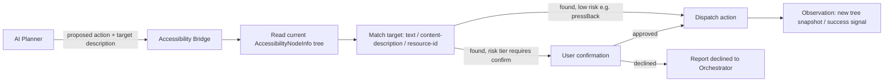

# 10 — Accessibility Architecture

## Read This First

This is the highest-risk architectural area in the project. `06_ANDROID_CAPABILITIES.md`
establishes the platform ground truth; this document translates that into a concrete, compliant
design. **No implementation of V7 begins before the risk in this document is explicitly accepted
and, ideally, validated against current Play Console guidance** — see `DOCUMENTATION_REVIEW.md`.

## The Policy Constraint, Restated

Google Play's Accessibility API policy prohibits an app from using the Accessibility API to
"autonomously initiate, plan, and execute actions or decisions" unless the app is declared and
qualifies as a genuine accessibility tool for users with disabilities. Deterministic, human-authored
rule-based automation ("if X, do Y") is explicitly allowed. JARVIS's core value proposition — an
AI that decides, at runtime, what to do based on model reasoning — is structurally an "autonomous"
use, not deterministic rule automation, and JARVIS's primary purpose is a general assistant, not
an accessibility tool for people with disabilities.

## Design Response: Confirmed, Bounded Automation Rather Than Freeform Autonomy

The architecture narrows what the Accessibility Bridge actually does, specifically to move as far
as possible toward the deterministic, user-directed end of the spectrum:

1. **Human-in-the-loop by construction, not just by setting.** The AI Planner identifies *what it
   believes should happen next* (e.g., "tap the search result titled X"), but the Accessibility
   Bridge does not execute a chain of such decisions unattended for MEDIUM/HIGH-risk targets — it
   surfaces the specific proposed action, grounded in the actual current accessibility-tree
   snapshot, for the user to confirm (voice "yes"/"go ahead" or a tap) before each HIGH-risk step
   executes (per the risk tiers in `08_AGENT_AND_TOOL_SYSTEM.md`).
2. **Deterministic execution primitives.** Once a target node is confirmed, the actual dispatched
   gesture/action (`performAction`, `dispatchGesture`) is a deterministic operation against a
   specific, already-identified node — the "planning" happens in the AI layer and is surfaced to
   the user, not silently chained by the Accessibility Bridge itself.
3. **Scope limitation.** The Accessibility Bridge only ever acts within the single app the user
   named or that is currently foregrounded — it does not roam across arbitrary apps searching for
   things to do.
4. **No opportunistic use.** The AccessibilityService is not used for any purpose beyond the
   specific tool calls in the registry — no passive background monitoring, no data collection
   beyond what a given confirmed action needs.

## Open Item: Distribution Strategy

Given the compliance ambiguity, the roadmap requires (see `DOCUMENTATION_REVIEW.md`):
- Seeking explicit clarification/declaration guidance from Play Console before V7 is submitted to
  Play, and
- Maintaining a fallback distribution path (direct APK distribution / a testing track) so
  development and personal use are not blocked while Play compliance is being resolved.

This document does not resolve the ambiguity — it is a legal/policy judgment call outside
engineering's authority — but it ensures the engineering design is built to be as defensible as
possible and does not bake in an assumption of unrestricted automation that would need to be
ripped out later.

## Technical Design

### Node Matching Strategy (in priority order)

1. `contentDescription` exact/semantic match.
2. Visible text match.
3. `resource-id` match (fragile across app updates — used only as a last resort, and never as the
   sole signal without also confirming visible text/description agree).
4. **Explicitly not used as a primary strategy**: fixed screen coordinates. Coordinate-based
   fallback is reserved for a documented last-resort path (e.g. custom-rendered canvases with no
   accessible node info) and is flagged as low-reliability, high-maintenance in the UI to the
   user ("I'm not confident about this tap").

### Reliability Limitations to Design Around

- Apps using custom rendering (games, some Compose/Flutter/Unity/WebView-heavy UIs) may expose
  little to no usable accessibility-node information — the tool must detect this ("no actionable
  elements found") and fail gracefully rather than guess.
- Apps that set `FLAG_SECURE` or otherwise resist automation/screenshotting are outside JARVIS's
  reach entirely by design (often banking/payment apps) — this is treated as expected and correct
  behavior, not a bug to work around.
- UI layouts change between app versions; node-matching by text/description is more resilient than
  by index/coordinate but is not immune to this.

## What Must Never Be Built on Top of This

- Silent background automation with no visible indication to the user that JARVIS is interacting
  with another app.
- Automation targeting security-sensitive UI (password fields, payment confirmation screens,
  2FA codes) — these are explicitly excluded from the tool's allowed target set at the schema
  level, not just by convention.
- Reading accessibility content from apps not currently in active, user-initiated use.
