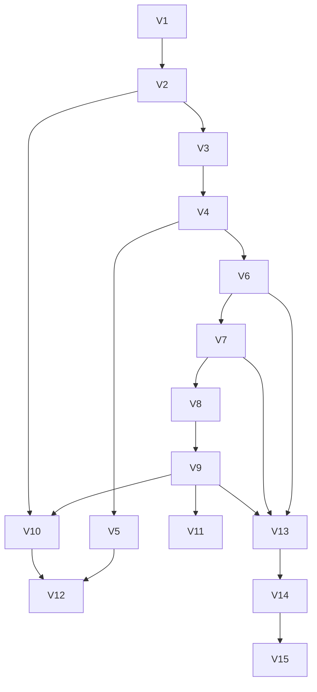

# 20 — Version Roadmap

## Order and Rationale

```
V1  Foundation
V2  Basic AI Conversation
V3  Voice Interaction
V4  JARVIS UI / Activation Animation
V5  Wake Word
V6  Basic Android Actions
V7  Accessibility Integration
V8  Screen Understanding
V9  Multi-Step Agent
V10 Web / Internet Intelligence
V11 Memory
V12 Offline Capabilities
V13 Security Hardening
V14 Performance & Reliability
V15 Production Release
```

This is the order defined in the original product brief, and it survives technical review with
one deliberate note: **V4 (UI/activation animation) is placed before V5 (wake word)** intentionally
— the visual identity and voice state machine need to exist and be stable before wake word adds a
new, always-on entry point into that same state machine, so the state machine is proven under the
simpler "tap to talk" trigger first (Constitution Rule 11 — no premature flash, but also no
premature complexity layering).

Similarly, **V7 (Accessibility Integration) intentionally precedes V8 (Screen Understanding) and
V9 (Multi-Step Agent) but follows V6 (basic, low-risk Android actions)**: the project builds
confidence and test infrastructure on the low-risk, well-supported API surface first (V6) before
touching the highest-risk, policy-sensitive capability (V7), and screen understanding (V8) and
full multi-step orchestration (V9) both depend on the Accessibility Bridge existing and being
trustworthy.

## Dependency Graph



Notes:
- V10 (Web Intelligence) only strictly needs V2 (an AI conversation loop) and benefits from V9's
  planning infrastructure for combining web answers with actions, hence the two incoming edges.
- V12 (Offline) depends on both V5 (wake word, the main offline-relevant surface) and V10 (so it's
  clear what must gracefully degrade rather than simply break).
- V13 (Security Hardening) is a deepening pass across everything risk-relevant built so far
  (V6 device actions, V7 accessibility, V9 agent loop) rather than a green-field version — see its
  file for what "hardening" concretely adds beyond what's already required inline in V6/V7/V9.

## Per-Version Summary

Full detail lives in `versions/VN_*.md`. Summary:

| Version | Core Deliverable | Key Risk |
|---|---|---|
| V1 | Project skeleton, module structure, CI, empty-but-runnable app | Low |
| V2 | Text-based conversation with Gemini via secure relay | Low — mainly API integration correctness |
| V3 | Voice in/out, state machine, interruption handling | Medium — latency/UX tuning |
| V4 | Activation animation, idle UI, personality-consistent responses | Low — mainly design/legal-originality care |
| V5 | Tier-1 foreground-service wake word; Tier-2 Assistant-role path documented as optional | Medium-High — battery, reliability, Assistant-role instability |
| V6 | Low-risk device actions (timers, media, settings screens, notifications) | Low-Medium |
| V7 | Accessibility Bridge with confirmed, bounded automation | **High — Play policy compliance** |
| V8 | Screen reading/understanding, privacy filtering | Medium — privacy correctness |
| V9 | Full multi-step agent loop with verification/adaptation | Medium-High — compounding failure modes |
| V10 | Web search grounding, routing between static/current/device/user-specific | Low-Medium |
| V11 | Persistent memory with full user controls | Medium — privacy correctness |
| V12 | Defined offline-capable subset | Medium — scope discipline (don't overclaim) |
| V13 | Security hardening pass across V6/V7/V9 surfaces | Medium |
| V14 | Performance/battery/reliability tuning against budgets | Low-Medium |
| V15 | Store listing, privacy policy, final compliance review, release | Medium — Play policy for V7/accessibility must be resolved here at the latest |

## Exit Criteria for the Roadmap as a Whole

The project is "V1.0 production" when V15's exit criteria are met — not when every conceivable
JARVIS feature exists. Anything beyond this roadmap (multi-user support, cross-device sync,
additional platforms) is explicitly out of scope and would begin a new roadmap, not an extension
bolted onto V15.
